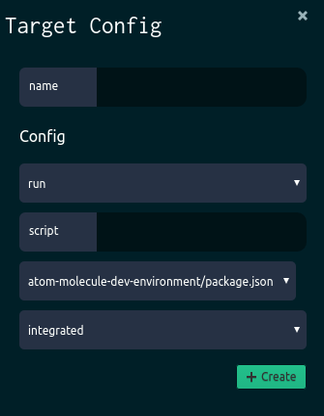
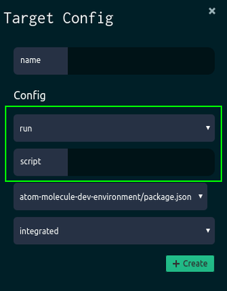

# Integration API: Documentation
**If you didn't read the README.md do it before going any further.**

You must export as an object every information that is asked in the sections below.
The final result of the integration must look like:

    export default {
      infos: {
        ...
      },
      configSchema: {
        ...
      },
      getStrategyForTarget(target: TargetConfig) {
        ...
         return {
           strategy: {
             ...
           },
           controller: {
             onStdoutData(data: string, taskAPI: TaskAPI): void {
               ...
             },
             onStderrData(data: string, taskAPI: TaskAPI): void {
               ...
             },
             onExit(code: number, taskAPI: TaskAPI): void {
               ...
             },
             onError(err: any, taskAPI: TaskAPI): void {
               ...
             }
           }
         };
      },
      isPackage: ...
    };


## Requirements

First of all, add your *js* file in the **lib/ExecutionControlEpic/Plugins/** directory.

Then add the following imports to your file:

    import type {TargetConfig} from "../TargetConfigurationFeature/Types/types.js.flow";
    import type {TaskAPI} from "../DevtoolLoadingFeature/Types/types.js";
    import path from 'path';

>Don't worry about them for now, we'll use them in a couple of steps.

Of course don't forget to *export default* your object, like:

    export default {
    };

>Note that every object you will create in the next steps has to be inside the *export default*

Now you can go on the following sections !

## Infos

First, you'll have to create an **infos** object that has only 2 attributes:

* **name**: the name of the tool
* **iconUri**: the uri pointing to the icon of the tool (which should be in *atom://molecule-dev-environment/.storybook/public/tool-name.png*)

For exemple:

    infos: {
      name: 'docker',
      iconUri: 'atom://molecule-dev-environment/.storybook/public/devtool-icon-docker.png'
    }


## ConfigSchema

This section is very important, you are going to define the way a user can create a target for a better use of your tool.

---
>Here is an example of the creation of a target:

>

>**MUST READ**: The *name* box is a default one, it will be the name of your target once created. The last 2 boxes before the *Create* button are also default ones:
>They allow the user to chose the package in which the target will be executed and how the process will be executed:
* **integrated** : process as child of atom process
* **local** : process as child of process launched as child of atom
* **remote** : process launched on a remote machine

>

>This is the **npm** tool target configuration. As you can see, only the 2 circled boxes are required for npm to create a target:
* action (= run/start/test)
* script (= name of the script)

>They are defined by the following configSchema:
>```
configSchema: {
  type: 'conditional',
  expression: {
    type: 'enum',
    enum: [
      {value: 'run', description: 'run'},
      {value: 'start', description: 'start'},
      {value: 'test', description: 'test'}
    ]
  },
  cases: {
    run: {
      type: 'string',
      default: '',
      title: 'script',
      placeholder: 'script'
    },
    start: null,
    test: null
  }
},
```
Note that a configSchema is the (only) way of Molecule to ask the user for input. So make sure to collect every user-related data you need in order to execute your tool properly in those configSchemas.

---

A **configSchema** can be divided in several **configSchemaParts**, and every part shares a basis composed of 4 attributes:
* **type** : the type of the config part.
* **default** : the default value of the corresponding type.
* **title** : depending on the type declared beforehand, a title will generally be displayed as a 'label' of the element (see the example above).
* **description** : depending on the type declared beforehand, a description will be adding details after the title.

First, here are the available types (and their attributes) for your tool's configSchema:

* **string** : asks the user for input as a string (= input box).
  * *placeholder* - a hint inside the input box (optional)

>Example:
```
type: 'string',
default: '',
title: 'script',
placeholder: 'Script name'
```
---

* **number** : asks the user for input as a number (= input box).
  * *placeholder* - a hint inside the input box (optional)

>Example:
```
type: 'number',
default: '80',
title: 'port',
placeholder: 'Port number'
```
---

* **boolean** : asks the user for a true/false input (= check box).

>Example:
```
type: 'boolean',
default: 'true',
title: 'Enable potato mode'
```
---

* **object** : the object type allows you to create your own schema through the *schemas* attribute.
  * *schemas* - a schema is a configSchemaPart associated with a key. An object can contain mutliple schemas.

>Example:
```
type: 'object',
schemas: {
  image: {
    type: 'string',
    default: '',
    placeholder: 'ex: ubuntu'
  },
  port: {
    type: 'number',
    default: '80',
    title: 'port',
    placeholder: 'Port number'
  }
}
```
---

* **array** : this type enables the possibility for the user to generate (0 to n) items defined in the *items* attribute. (Thanks to a '+' button)
  * *items* - an item is a **configSchemaPart** which will appear when the '+' button is clicked

>Example:
```
type: 'array',
default: [],
items: {
  type: 'object',
  schemas: {
    image: {
      type: 'string',
      default: '',
      placeholder: 'ex: ubuntu'
    },
    port: {
      type: 'number',
      default: '80',
      title: 'port',
      placeholder: 'Port number'
    }
  }
}
```
---

* **enum** : this type allows you to declare an array of elements from which the user can chose using a drop-down menu. (generally used with **conditional** as the *expression*)
  * *enum* - it is an array of mixed elements having 2 attributes:
    * value : equivalent to a *key*, code-related value
    * description : the caption displayed in the drop-down menu

>Example:
```
type: 'enum',
enum: [
  {value: 'local', description: 'Local'},
  {value: 'global', description: 'Global'}
]
```
---

* **conditional** : this type allows you to create different configSchemaParts depending on the *expression* input. Think of it as a switch function.
  * *expression* - ask the user for input using one of the above types
  * *cases* - for each value declared in the *expression* attribute, another configSchemaPart is expected

>Example:
```
type: 'conditional',
expression: {
  type: 'enum',
  enum: [
    {value: 'local', description: 'Local'},
    {value: 'global', description: 'Global'}
  ]
},
cases: {
  local: {
    type: 'string',
    default: '',
    title: 'cmd',
    placeholder: 'Shell command'
  },
  global: {
    type: 'number',
    default: '0',
    title: 'iterations',
    placeholder: 'Number of iterations'
  }
}
```
---


## Target Strategy

This is the part where you get to use the imports you previously added to your file. Make sure you didn't forget those [imports](#requirements), and then add the **getStrategyForTarget(target: TargetConfig)** function as in:

```
export default {
  infos: {
    [tool infos]
  },
  configSchema: {
    [tool configSchema]
  },
  getStrategyForTarget(target: TargetConfig) {
    /* TO-DO */
  }
};
```
>As you can see you get a **target** variable from the **getStrategyForTarget** function. This variable will provide you the different parameters of the target configuration:
* the path of the package (through *target.packageInfos.path*)
* the data of your configSchema (through *target.config*)

>For example, let's say your configSchema is composed of an object containing a boolean type which has as name 'check', this is how you access it:
>```
let cmdArgs;
if (target.config.check) {
  cmdArgs = '--check-all-files';
}
```

This function will contain the content of the notifications you are going to provide to the user through the bottom dock of Molecule.

To get started, know that this function has to return an object composed of two objects: **strategy** and **controller** like:
```
getStrategyForTarget(target: TargetConfig) {
  /* You're free to do whatever operations you need to
  in order to be ready to pass informations through the return */
  ...
   return {
     strategy: {
       ...
     },
     controller: {
       ...
     }
   };
 }
```

Here is a description of the content of those two:
* **strategy** : the way you are going to execute your tool
  * **type** - the type of the process, it can be 'shell' or 'node'
    * **shell** - if the shell type is selected, you must set the **command** variable with the command you want to execute through shell
    * **node** - if the node type is selected, you must set the **path** variable with the path to the script you want to execute
  * **cwd** - the directory from which the command will be executed

>Example:
```
strategy: {
  type: 'shell',
  command: `${binaryPath} ${target.config.task}`,
  cwd: path.dirname(target.packageInfos.path),
}
```
> The **path** import is used so we can properly set the directory in which the command will be executed.

---


* **controller** : the controller provides you 4 functions in which you will be able to add diagnostics to the bottom dock of Molecule, you will have to use the **addDiagnostics()** function through the taskAPI
  * **onStdoutData** *(data: string, taskAPI: TaskAPI, helperAPI): void* - function called if your tool communicates through STDOUT
  * **onStderrData** *(data: string, taskAPI: TaskAPI, helperAPI): void* - function called if your tool communicates through STDERR
  * **onExit** *(code: number, taskAPI: TaskAPI, helperAPI): void* - function called on the tool's exit
  * **onError** *(err: any, taskAPI: TaskAPI, helperAPI): void* - function called if the command executed in **strategy** fails

As you can see there are two APIs you get from each function:
  * **taskAPI** : the main API of Molecule, from which you will be able to store data thanks to our cache system and display your logs through diagnostics
    * **addDiagnostics** is your way of adding notifications to the bottom dock of Molecule, takes an array of *Diagnostics* as parameter, a Diagnostic is an object composed of:
      >* **type** - can be 'error', 'warning', 'success' or 'info' (each of them has a different display on the dock)
      * **message** - the data displayed in the diagnostics panel, different types of data can be passed:
        * a *string* displayed as a simple text
        * an *object* as in { text : string, html : boolean } with *text* being the actual message as a string and html a boolean which, if set to true, will display the string as HTML (supports HTML tags)
        * an *object* as in { data : string } with data being a string which, if filled with JSON, will be displayed as 'beautified' JSON
        * a *React Component*, it can be a function as well as a class extending 'React.Component'
      * **date** - the date associated with the message

    * **nextStep** is a function that allows your tool to separate your diagnostics during _a single_ Target execution, they will then be separated in 'Steps'

    * **cache** is an object containing an array of data. The **cache** object will provide you with two functions, from which you will be able to store and access data throughout the Target's execution (works with the Stepping System: the **nextStep** function will force you to a new and empty cache):
      >* **push** takes only one argument : the data you wish to store, it can be of any type. Note that by calling this function several times you are pushing data into an array
      * **get** will return the array stored in **cache**

  * **helperAPI** : the secondary Molecule API, which will be providing useful elements for integration:
    * **outputToHTML** transforms a string into a displayable HTML element
    * **json** is an object which only contains (for now) a **parseAsync** function taking a string as argument, which will be asynchronously parsed through the 'JSON.parse' function thanks to a Promise, and will _then_ be return to you

>Example:
```
controller: {
  onStdoutData(data: string, taskAPI: TaskAPI, helperAPI): void {
    taskAPI.cache.push(data.toString());
  },
  onStderrData(data: string, taskAPI: TaskAPI, helperAPI): void {
    taskAPI.addDiagnostics([{
      type: "warning",
      message: {
        text : helperAPI.outputToHTML(data.toString()),
        html : true,
      },
      date: moment().unix(),
    }]);
  },
  onExit(code: number, taskAPI: TaskAPI, helperAPI): void {
    helperAPI.json.parseAsync(taskAPI.cache.get().map(blob => blob.data).join('')).then((json) => {
      taskAPI.addDiagnostics(json.logs.map(log => ({
        type: "info",
        message: log,
        date: moment().unix(),
      })));
    }).catch(e => {
      console.log(e);
    });
  },
  onError(err: any, taskAPI: TaskAPI, helperAPI): void {
    taskAPI.addDiagnostics([{
      type: "error",
      message: {
        data : err,
      },
      date: moment().unix(),
    }]);
  }
}
```
>The **moment** import is used to associate a time to a the logs.

---

## Package definition

Last but not least, add a **isPackage** attribute. This will define the way your tool can identify packages and so operate on the proper projects.

>The **isPackage** attribute can receive several type of value: function, string or regexp.

* **function** : if you chose to express your isPackage with a function, note that you will receive two arguments: packagePath & dirname
  * **packagePath** - full path + file name (*ex: /home/toto/projectdir/package.json*)
  * **dirname** - it is an object containing the *name* of the current tested directory and an array *files* of all the files contained in it

>Example:
```
isPackage: (packagePath, dirname) =>
 path.basename(packagePath).indexOf("jest.config") != -1 ||
 path.basename(packagePath).indexOf(".jest.") != -1 ||
 path.basename(packagePath) == 'package.json',
```
---

* **string** : the string is the name of the file describing your package, plain and simple

>Example:
```
isPackage: 'package.json'
```
---

* **regexp** : the regexp will be tested against the full path followed by the file name (ex: */home/toto/projectdir/package.json*)

>Example:
```
isPackage: /gulpfile|gruntfile)\.js/
```
---
