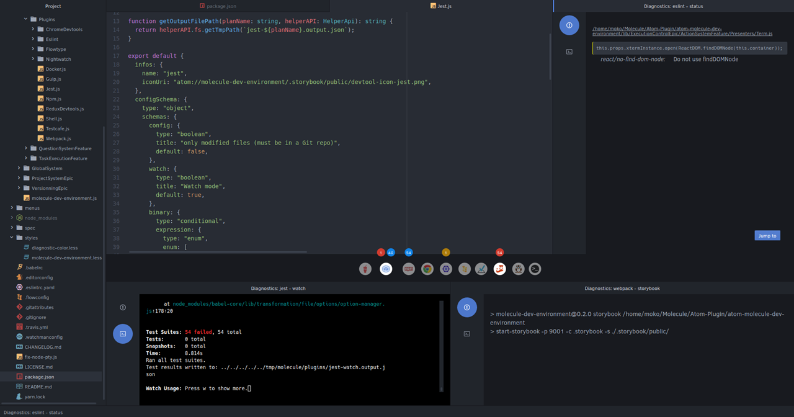

Molecule IDE
============

Molecule is a package that transforms [Atom](https://atom.io/) into a full-blown [Integrated Development Environment](https://en.wikipedia.org/wiki/Integrated_development_environment) (or IDE). Learn more [on our website](http://www.molecule.sh/) or read [our documentation](doc/getting-started.md).



Features
--------

While keeping Atom's intuitive, customizable approach, Molecule adds the
expected features of an IDE to Atom:

* In-editor compilation
* Code analysis
* Error diagnostics

The key advantage of Molecule over monolithic IDEs is its potential for
adaptation: where most IDEs are only valid for a few programming langages or
environments, developers can easily add plug-ins to Molecule (as Atom packages).
Users are able to download the plug-ins to adapt to new langages, without having
to change their IDE, habits, settings, keybindings, etc.

**Warning:** Molecule is still in an early alpha stage. The current state is far
from what we want to achieve and it is still full of bugs. We are working hard
to correct them as soon as possible and to add the features we are planning and
you request. So feel free to give us some [feedback](#feedback), we'll be very
happy! ;)

Installation
------------

1.  **[Install Atom](http://flight-manual.atom.io/getting-started/sections/installing-atom/) version 1.17.0 or higher**

2.  **Install Molecule**

    Molecule isn't available on `apm` (the official tool for downloading Atom
    packages) yet. To install Molecule, use the following commands:

    ```bash
    git clone https://github.com/alanzanattadev/atom-molecule-dev-environment.git
    cd atom-molecule-dev-environment
    git checkout v0.4.0
    npm install
    apm link
    ```

    Molecule should then be installed the next time you start Atom.


### Update

```bash
  cd atom-molecule-dev-environment
  git checkout vX.Y.Z # Where X.Y.Z is the current version number
  rm -rf node_modules
  npm install
```

And reload atom !

## Contribute

### Feedback

[Comment]: # (TODO - ADD LINK TO API)

We are open to any kind of feedback you could give us. From bug fixes to
recommandations and feature requests, we would love to hear what you think of
Molecule.

You can send feedback on our [website](https://www.molecule.sh) or open a
[GitHub issue](https://github.com/alanzanattadev/molecule-landing/issues).
We love discussing with our users !

### Make a plugin

[Comment]: # (TODO - ADD LINK TO PLUGIN API)

### Help develop Molecule

[Comment]: # (TODO - ADD LINK TO DEVELOPER DOC)

In order to contribute to Molecule, you need to clone this repository and open
its directory. To link the development version of Molecule with atom, run
`apm link -d`. The `-d` option link it as a development package (to be used in
atom development mode). Remove it to link the package with atom directly.
