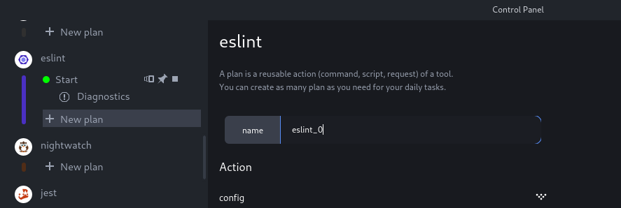
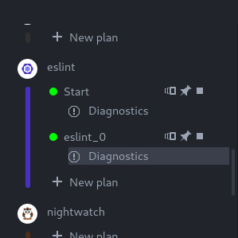

Creating a plan
===============

To create a new plan for a plugin, click the "New plan" button, under this
plugin. The plan configuration interface should open in the Control Panel.

This interface displays a list of settings specific to each plugin. You can
tweak the settings' values, then click the green "Create" button at the bottom
to add a plan.

For this tutorial, we will create an eslint plan:

- Click the "New plan" button under the "eslint" plugin
- Set name to "eslint_0",
- Leave the other settings as-is
- Click the "Create" button.

A new plan named "eslint_0" should have appeared in the Plugin Subpanel.

You can click on the "Play" button, which will run `eslint` and start giving you diagnostics.

### Package

When creating a new plan, one of the configuration settings for all plugins is
"package". If the project includes several package files for the current plugin
(for instance, if the project has several folders with `package.json` files
when creating an Eslint plan), then the "package" setting allows you to choose
which package the plan will use.

### Stager

The stager setting allows you to pick a **Stager** for your plan. The stager
allows you to decide how the plan will be executed: locally, or on a distant
machine.

Most of the time, leaving the default value is fine; you only need to execute
your plan locally.
