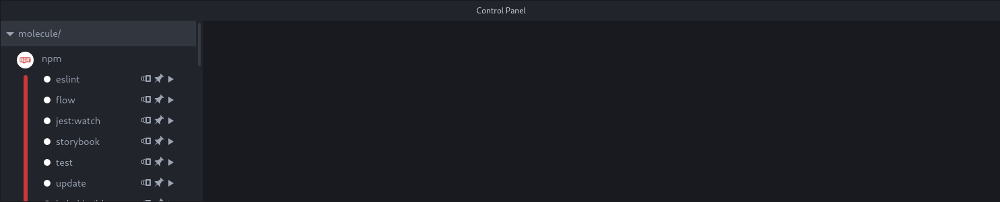
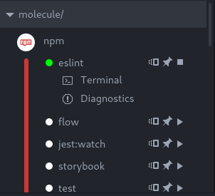

Using a plan
============

When starting Atom, your screen should look somewhat like this:

*Note: for the sake of this tutorial, we are browsing [the Molecule repository](https://github.com/alanzanattadev/atom-molecule-dev-environment/)*

The main addition is the **Control Panel**, which is located at the bottom of
the screen by default. On the left of this panel is the **Plugin Subpanel**.

Plugin Subpanel
---------------

The Plugin Subpanel displays a list of Molecule plugins, that adapts to the
current project by only displaying plugins for tools the project actually uses.

Molecule decides which tools the project uses by browsing for files that we call
**Packages**. For instance, if the project directory has an `.eslintrc` file,
then Molecule considers that the project uses the Eslint tool, and displays the
Eslint plugin in the Plugin Subpanel.

Which files count as a package varies from plugin to plugin. Most Node.js
plugins consider `package.json` to be a package file if the corresponging tool
is installed in `node_modules`.

### Plans

To execute these plugins, you need to create a **Molecule plan**. A plan is a
reusable action that executes a given plugin with pre-registered parameters. For
instance, you can create a plan for the NPM plugin that will always call
`npm run start`.

Each plugin is displayed with a list of plugin-specific, pre-generated plans,
and an option to [create a new plan](creating-a-plan.md).

Each plan is displayed with two buttons:

- A "Pin" button, that adds the plan to a list of "pinned" plans displayed above
the Control Panel.

- A "Play" button that runs/stops the execution of the plan.

Click the "Play" button next to the npm plan "eslint". Two additional buttons
should appear under that plan:

- The Diagnostics button opens the [Diagnostics Subpanel](#diagnostics-subpanel).

- The Terminal button opens the [Terminal Subpanel](#terminal-subpanel).

As you may have noticed, the Jest plan "Watch mode" runs in, well, watch mode:
this means it never stops until you click the play button again. If you edit one
of your source files, the changes will be sent to the running instance of Jest.
If these changes cause new errors, Jest will send error messages automatically
(see below).

Most of the "watch mode" plans are automatically executed on startup.

Diagnostics Subpanel
--------------------

All Molecule plugins have the same workflow:

* They analyse your project's files.
* They execute some operation on these files
* They output a stream of plugin-dependent messages.

These messages are called **Diagnostics**, and can be accessed in the
**Diagnostics Subpanel**.

Once you've executed a plan, the Diagnostics Subpanel will start to
fill. There are several types of diagnostics, with different colors:

- Errors
- Warnings
- Informations
- Hints
- Successes

For most plugins, diagnostics are only sent if you do something wrong. They
indicate syntax errors, code smells, etc.

Clicking on a diagnostic will lead you to the place in the code it concerns. For
instance, clicking on a syntax error diagnostic will open the relevant file, and
place your cursor at the beginning of the error.

Terminal panel
--------------

Most Molecule plugins use a command-line tool. For instance, the Eslint plugin
is based on the `eslint` CLI.

While plugins try to parse the text these CLIs output into more readable
diagnostics, sometimes you may want to read the text output directly. You can
switch to the Terminal Panel by clicking on the "Terminal" button under the
concerned plan.

Some plugins may ask you to enter text into the Terminal Panel (ex: a password).
However, in most cases, interacting with the Terminal is impossible.
