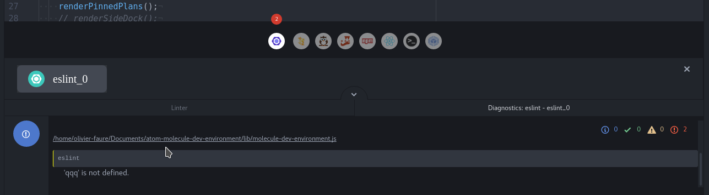
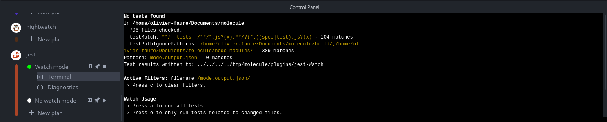

Using a plan
============

In the previous chapter, we have created a plan named "eslint_0". You can run
this plan by clicking on the corresponding button, which will run `eslint` and
output its diagnostics.

As you may have noticed, the eslint plan runs in watch mode: this means it never
stops until you click on it again. If you edit one of your source files, and
add some errors, the changes will be sent to the eslint instance, which will
process them and send error messages automatically.

Diagnostics panel
-----------------

All Molecule plugins have the same workflow:

* They analyse your project's files.
* They output a stream of plugin-dependent messages.

These messages are called **Diagnostics**, and can be accessed in the
**Diagnostics Panel**.

You can open the diagnostics panel of a given tool by clicking on the tool's
icon. For instance, you can open the diagnostics for your Eslint plan by
clicking on the Eslint icon.

Once you execute the Eslint plan (by clicking on the "eslint_0" button), the
diagnostics panel will start to fill. There are several types of diagnostics:

- Errors
- Warnings
- Informations
- Hints
- Successes

For most plugins, diagnostics are only sent if you do something wrong. They
indicate syntax errors, code smells, etc.

Clicking on a diagnostic will lead you to the place in the code it concerns. For
instance, clicking on a syntax error diagnostic will open the relevant file, and
place your cursor at the beginning of the error.

Terminal panel
--------------

Most Molecule plugins use a command-line tool. For instance, the Eslint plugin is
based on the `eslint` CLI.

While plugins try to parse the text these CLIs output into more readable
diagnostics, sometimes you may want to read the text output directly. You can
switch to the Terminal Panel by clicking on the "Terminal" icon at the
bottom-right for the Diagnostic panel.

Some plugins may ask you to enter text into the Terminal Panel (ex: a password).
However, in most cases, interacting with the Terminal is impossible.
