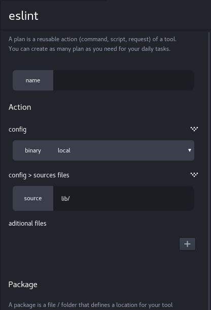

# Creating a plugin

Molecule's main strength is to leverage Atom's extensibility. You can integrate
new tools to Molecule by creating plugins in which you define how Molecule
should interact with the tools.

For instance, if you want to integrate a new language (say, Ocaml) to Molecule,
you need to create a **Molecule Plugin** for this language.

This article details Molecule's plugin API and how to use it.

## The plugin system

A Molecule plugin is a JavaScript object with the following fields:

``` js
export default {
  info: {
    // ...
  },
  configSchema: {
    // ...
  },
  getStrategyForPlan(plan: PlanConfig, helperApi: HelperAPI) {
    // ...
    return {
      strategy: { /* ... */ },
      controller: { /* ... */ }
    };
  },
  generatePlansForPackage(packageName: string): Array<GeneratedPlanObject> {
    // ...
  }
  DiagnosticView: /* ... */,
  isPackage: /* ... */
};
```

Once you have built this object (see **Plugin Structure** for details), you
must send it to Molecule's plugin handler. This can be done in several ways.

### As an Atom Package

This feature is not available yet.

[Comment]: # (TODO - Complete section once package integration is done)

### In Molecule's source code

If you're a Molecule contributer, and you want to add your plugin directly to
Molecule's codebase, you need to follow these steps:

* Add your plugin and **all the files it uses** to the
`lib/ExecutionControlEpic/Plugins/<plugin name>` directory. All the required
files (helpers, presenters, etc) must be in this directory or a sub-directory.
* Export your plugin object from the
`lib/ExecutionControlEpic/Plugins/<plugin name>/index.js` file, using the
`export default` statement.
* Add `<plugin name>/index.js` to the plugin list in
`lib/molecule-dev-environment.js`

When in doubt, you can consult [one of the existing plugins](https://github.com/alanzanattadev/atom-molecule-dev-environment/tree/master/lib/ExecutionControlEpic/Plugins)
as an example.


## Plugin Structure

As shown above, a plugin object has the following fields:

### `info`

The `info` field is a Javascrit object that Molecule uses to display the plugin.
This object has the following fields:

  * **name**: the name of the plugin
  * **iconUri**: the uri pointing to the icon of the plugin (which should be in
  *atom://molecule-dev-environment/.storybook/public/<plugin-name>.png*)

Example:

``` js
info: {
    name: "eslint",
    iconUri: "atom://molecule-dev-environment/.storybook/public/devtool-icon-eslint.svg",
}
```

### `configSchema`

When [creating a plan](../new-user/creating-a-plan.md) for a plugin, a panel
named **Plan configuration** opens, and displays a bunch of form inputs.

Some of the inputs are present for all plugins (the plan's name, package file,
and stager) and are used internally by Molecule.

The other inputs are depend on the plugin's `configSchema`, which is an object
that defines a list of inputs (checkboxes, text inputs, etc.) that the user will
be asked to fill out.

Molecule automatically generates the **Plan configuration** UI depending on
this schema. For instance, checkboxes are generated for boolean fields, text
boxes are generated for string fields.

As an example, the Eslint plugin declares the following schema:

``` js
configSchema: {
  type: "object",
  schemas: {
    binary: {
      type: "enum",
      label: "binary",
      enum: [
        { value: "local", description: "local" },
        { value: "global", description: "global" },
      ],
    },
    sources: {
      type: "object",
      label: "sources files",
      schemas: {
        source: {
          type: "string",
          label: "source",
          placeholder: "lib/",
          default: "lib/",
        },
        sourceArray: {
          type: "array",
          label: "aditional files",
          items: {
            type: "string",
            label: "source",
            placeholder: "lib/",
          },
        },
      },
    },
  },
},
```

From this, Molecule generates the following config UI:



Once the user is done configuring and clicks the "Create" button, a config
object is generated based on what the user has entered; this object is then
passed to the plugin's `getStrategyForPlan` method (see below).

For details on the `configSchema` API, see
[configSchema reference](./configSchema-reference.md).

### `getStrategyForPlan`

The `getStrategyForPlan` method represents the main entry point of your plugin.
It's called when the user finishes the configuration step and creates a plan.
It must return an object describing how Molecule should interact with the
plugin.

The parameters passed to `getStrategyForPlan` are:

  * **plan**: an object with the following fields:
    * **name**: the plan's unique name.
    * **config**: a **PlanObject** generated based on what the user entered
    into the plan configuration panel. See
    [configSchema reference](./configSchema-reference.md#plan-config).
    * **packageInfos.path**: path of the plan's [package](../new-user/creating-a-plan.md#package-system).
  * **helperApi**: an API providing methods to facilitate your development,
  such as JSON and terminal output-to-html parser, filesystem abstraction, and
  severity levels used in diagnostics. See
  [HelperAPI reference](./HelperAPI-reference.md).

[Comment]: # (TODO - Add PackageInfo API)

The returned object must have the following fields:

  * **strategy**: an object describing how the tool should be executed
  * **controller**: an object containing functions executed when Molecule receive
  data from the executed tool.

``` js
getStrategyForPlan(
  plan: PlanConfig,
  helperApi: HelperAPI,
): { strategy: Strategy, controller: Controller } {
  // ...
}
```

> Note: Molecule uses Flow's typing system to help ensure the codebase stays
> type-safe.
>
> The following types represent the different APIs you'll be able to use:
> ```
> import type { PlanConfig } from "../../PlanConfigurationFeature/Types/types.js.flow";
> import type { HelperAPI } from "../../TaskExecutionFeature/Model/HelperApi";
> import type { TaskAPI } from "../../DevtoolLoadingFeature/Types/types.js.flow";
> ```
> We recommend you use them in your plugin, to make sure your
> functions are compatible with our API.

The return value's **strategy** and **controller** fields represent different
concepts. The strategy is a plain Javascript object, with the information
necessary to _start_ the plugin's tool.

On the other hand, the controller is a dynamic object with methods, which are
called _when the tool is executed_, to link it with Molecule's frontend.

#### `strategy`

The `strategy` object must have the following fields:

  * **type**: the environment of execution of the tool. Possible values are:
    * **shell**: the process will be executed in a dedicated shell run by Molecule.
    In this mode, the plugin can only get data from the tool and there is no
    way to interact with it.
    * **terminal**: the process will be executed in a dedicated terminal run
    in Molecule. The user will have access to an xterm instance from the diagnostic
    panel and will be able to interact with the process. This is the best mode
    for tools that need inputs from the user.
    * **node**: the script will be executed inside a NodeJS instance. This is the
    best mode for tools that are written in JavaScript and made to be executed
    by NodeJS. Note that the code will still be executed in a different
    process, and as such behave like the other two types.
  * **command** _(shell and terminal strategies only)_: specify the command to
  execute.
  * **path** _(node strategies only)_: the path of the JS file to execute.
  * **args** _(node strategies only, optional)_: the arguments to pass to the
  script.
  * **cwd**: the working directory in which the command/script will be executed.
  * **env** _(optional)_: the environment variables to pass to the process.
  * **lsp** _(optional)_: boolean. See [below](#lsp-integration) for details.

Example:

``` js
strategy: {
  type: "node",
  path: path.join(__dirname, "Process", "lsp"),
  cwd: path.dirname(plan.packageInfo.path),
  env: {
    ESLINT_CWD: path.dirname(plan.packageInfo.path),
    ESLINT_BINARY: binaryPath,
  },
  lsp: true,
},
```

> Note: in this example, we use a file named `lsp.js` in the `Process` folder of
our plugin. This file implements a LSP wrapping of the ESLint CLI. See
[LSP Integration](#lsp-integration) for details.

#### `controller`

Once the tool has been started using the *strategy*, Molecule will load the
plugin's `controller`. The controller is an object with the following methods:

  * **onData** *(data: string, taskAPI: TaskAPI, helperAPI: HelperAPI): void*:
  this method is called every time some data is emitted by the tool, on stdout
  or stderr.
  * **onExit** *(code: number, taskAPI: TaskAPI, helperAPI: helperAPI): void*:
  this method is called when the tool exits, successfully or not
  * **onError** *(errcode: Number, taskAPI: TaskAPI, helperAPI: helperAPI): void*:
  this method is called when the tool exits unsuccessfully (e.g. main
  returns 1).

These methods are the only way for your plugin to execute code and interact
with the tool's output.

See [TaskAPI reference](./TaskAPI-reference.md) and
[HelperAPI reference](./HelperAPI-reference.md) for details.

#### LSP Integration

If your plugin's tool implements the
[Language Server Protocol](https://langserver.org/) - that is, if the tool
accepts LSP-compliant inputs and emits LSP-compliant outputs - then you can set
the strategy's `lsp` field to true. Molecule will then be able to communicate
with the tool without you having to write a controller.

Using the Language Server Protocol, Molecule can:

  * Receive diagnostics from the tool, and display them in the Diagnostic
  Subpanel
  * Integrate them to the linter (e.g. highlight syntax errors in red).
  * When the user clicks on a diagnostic, open the relevant file at the relevant
  location (e.g. where the syntax error is).

These interactions can all be implemented in the controller using the TaskAPI.
However, using the LSP integration is faster and requires much less work for
developing (and maintaining) your plugin; as such, we recommend you use it
whenever it is available.

> Note: It is possible to both use the LSP integration and define a custom
controller, as seen in the Eslint example. In that case, the tool's outputs are
sent to both the LSP parser and the plugin's controller.

#### Complete `getStrategyForPlan` example

In this example, we wrote our own implementation of the LSP protocol on top of the
tool. This implementation handle all outputs from `eslint` and transforms them
into LSP-formatted objects.

Note that because an error can happen before the real execution of the tool, we
still write the `onError` method. This will handle error happening in our
implementation of LSP for this tool (such as if the executable is not found) but
the errors produced by the tool itself will be treated as normal LSP errors.

``` js
getStrategyForPlan(
  plan: PlanConfig,
  helperApi: HelperApi,
): { strategy: Strategy, controller: Controller } {
  let binaryPath;
  const sources = `${
    plan.config.sources.source
  } ${plan.config.sources.sourceArray.join(" ")}`;
  if (plan.config.binary.expressionValue === "local") {
    binaryPath = `${path.join(
      path.dirname(plan.packageInfo.path),
      "node_modules",
      ".bin",
      "eslint",
    )}`;
  } else binaryPath = "eslint";
  const cmd = `${binaryPath} ${sources} -f json -o ${getOutputFilePath(
    plan.name,
    helperApi,
  )}`;
  return {
    strategy: {
      type: "node",
      path: path.join(__dirname, "Process", "lsp"),
      cwd: path.dirname(plan.packageInfo.path),
      env: {
        ESLINT_CWD: path.dirname(plan.packageInfo.path),
        ESLINT_BINARY: binaryPath,
      },
      lsp: true,
    },
    controller: {
      onError(err: any, taskAPI: TaskAPI, helperAPI: HelperApi): void {
        taskAPI.diagnostics.setForPath({
          uri: "eslint",
          diagnostics: [
            {
              severity: helperApi.severity.error,
              message: err,
              date: moment().unix(),
            },
          ],
        });
      },
    },
  };
},
```

### `generatePlansForPackage`

The `generatePlansForPackage` method is called at the start of Molecule, and
whenever a package file is updated. It generates the default plans that a user
of your plugin is likely to need. For instance, the NPM package generates one
plan per script in the `script` field of `package.json`.

The parameter passed to `generatePlansForPackage` is:

* **packageName**: the path of the concerned package.

The returned object must be an array of **GeneratedPlanObject**; each object in
the array must have the following fields:

* **name**: the plan's name; should be unique.
* **value**: a [PlanObject](./configSchema-reference.md#plan-config); its
values should possible to generate from the `configSchema`.
* **autoLaunch** _(optional)_: a boolean set to true if the plan should be
executed as soon as it's added. Most useful for passive syntax checkers.

### `DiagnosticView`

The plugin's `DiagnosticView` field is a
[React Component](https://reactjs.org/docs/components-and-props.html) which
defines how diagnostics are rendered in the
[Diagnostic Subpanel](../new-user/using-a-plan.md#diagnostics-subpanel).

A `DiagnosticView` component must accept the following props:

  * `path`: the path of the file that triggered the diagnostic (e.g. for a
  syntax error diagnostic, the path of the file where the error was found).
  * `message`
  * `severity`: a number describing the message's
  [severity](./HelperAPI-reference.md#severity).
  * `source`: a copy of the line of code that triggered the diagnostic.

### `isPackage`

The `isPackage` field is used to identify files that qualify as
[packages](../new-user/using-a-plan.md#plugin-subpanel) for the plugin.

When a project is opened with Molecule, it will browse through each file and
use each plugin's `isPackage` on them, to list all the project's packages.

The plugins for which at least one package is found will be displayed in the
Plugin Subpanel, grouped by directory.

The **isPackage** field can have several types of values: function,
string or regexp.

#### Function

The most flexible way to specify the `isPackage` field is as a method
that takes a file path and returns `true` if the file is a package.

This method can take two parameters:

  * **packagePath**: the absolute path of the tested file
  (ex: `/home/user/project/package.json`)
  * **directory** - an object containing the **name** of the directory, and a
  **files** field containing an array. This array contains all elements of the
  current directory, which can be either the element name (a **string**) if it is
  a file, or another **directory** object if it is a directory.

The **isPackage** method must either return a **boolean** or an **object**
with the following fields:

  * **name**: the name of the package.
  * **path**: the path of the package.
  * **type**: the type of the package. Can be `file` or `directory`.

The method can also return a Promise of either of these.

Example:

``` js
isPackage: (packageName: string, directory: PackageDirectory) => {
  if (path.basename(packageName).indexOf("eslintrc") !== -1) return true;
  else if (path.basename(packageName) === "package.json") {
    const check = new File(
      path.join(
        packageName.slice(
          0,
          packageName.lastIndexOf(path.basename(packageName)),
        ),
        "node_modules",
        "eslint",
      ),
    );
    return check.exists();
  } else {
    return false;
  }
},
```

#### String

The **isPackage** field can be a string that represents a filename that a file
must have to qualify as a package.

``` js
isPackage: ".flowconfig",
```

#### Regexp

The **isPackage** field can be a regexp that all files of the project are
compared against. A file is considered a package if its absolute path
(ex: `/home/user/project/package.json`) matches the regexp.

``` js
isPackage: /(gulpfile|gruntfile)\.js/
```
